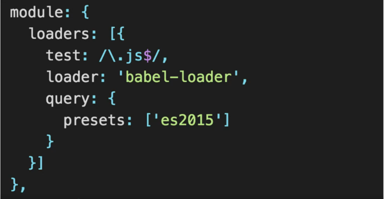

# ES6 란?

- ECMAScript 2015와 동일한 용어
- 2015년은 ES5(2009년)이래로 진행한 첫 메이저 업데이트가 승인된 해
- 최신 Font-end framework인 react, angular, vue에서 권고하는 언어 형식
- ES5에 비해 문법이 간결해서 익숙해지면 코딩을 훨씬 편하게 할 수 있음

# Babel

- 구 버전 브라우저 중에서는 ES6의 기능을 지원하지 않는 브라우저가 있으므로 transpiling이 필요
- ES6의 문법을 각 브라우저의 호환 가능한 ES5로 변환하는 컴파일러
  
